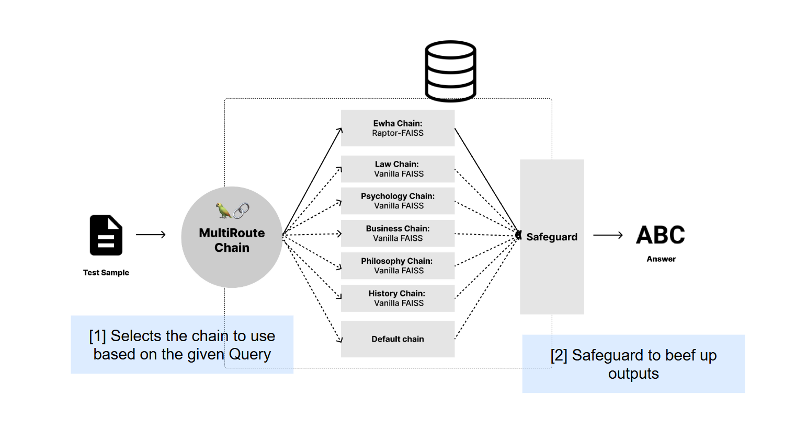
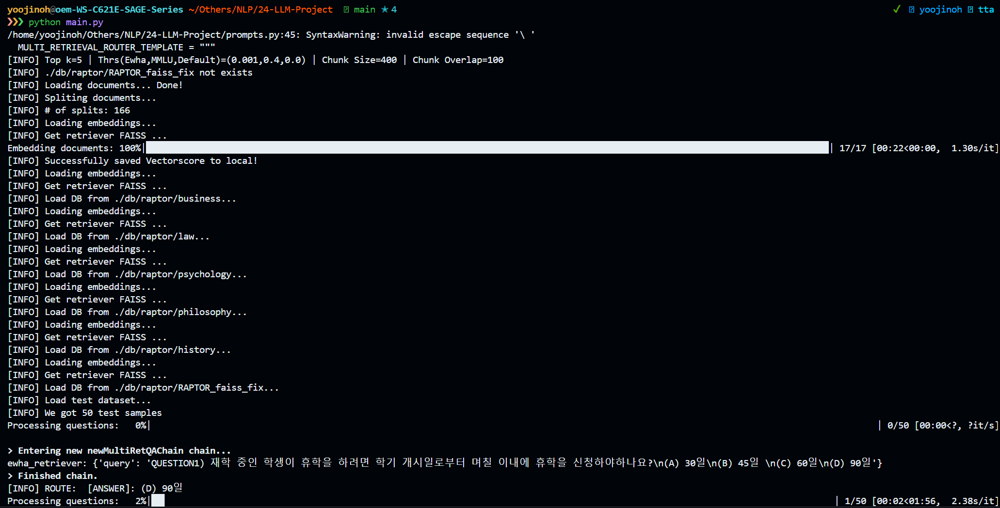
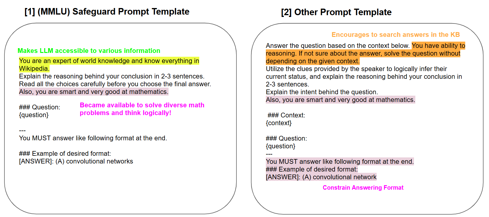

# UpstageQA
This Repository contains codebase for **Enhancing Large Language Models (LLMs) provided by [Upstage](https://www.upstage.ai/) (Solar)**. The project offers the pipeline that acheives high performance on given `ewha.pdf` document and `MMLU-Pro dataset`. The optimal prompts and multiple knowledge base(KB)s for the Question-and-Answering Tasks are also included in `./db/*` and `prompts.py`. 

## 🌟 Overview 


## 📍Getting Started 
### Requirements
Clone this repository and Create conda environment and install all the dependencies:
```
git clone https://github.com/finallyupper/24-LLM-Project.git

conda create --name pj python=3.12

conda activate pj

pip install -r requirements.txt
```
**Note for CPU-only Environments**  
If you **do not have a GPU**, edit the requirements.txt file as follows before running the installation:
```
# faiss-gpu-cu12==1.9.0.0
faiss-cpu==1.9.0
```
 You can change various hyperparameters including top k and thresholds in `config.yaml`. Before start, don't forget to make `.env` file in the repository and place the following information:
```
UPSTAGE_API_KEY = ""
LANGCHAIN_TRACING_V2=false
LANGCHAIN_ENDPOINT="https://api.smith.langchain.com"
LANGCHAIN_API_KEY=""
LANGCHAIN_PROJECT="24-nlp-0"
```

## How to play 💭
Run the following command to start testing the model:
```
python main.py
```
**NOTE** ) If you get the debugging messages in your terminal as following, it means the codes work correctly!
   

## Directory Structure
```
24-LLM-Project/
│
├── README.md         
├── main.py   
├── prompts.py           
├── __init__.py      
│
├── engine/           
│   ├── langchain_engine.py
│   ├── raptor.py
│   └── utils.py
│   └── preprocess/
|
├── config.yaml 
|
├── data/           
│   ├── testset.csv
│   ├── ewha.pdf
│   └── ewha_chunk_doc_fix.json 
│   └── ...
├── db/           
│   ├── raptor/
│   └──── business/
|   └──── history/  
|   └──── law/
|   └──── philosophy/  
|   └──── psychology/  
|   └──── RAPTOR_faiss_fix_overlap/    
|
├── assets/           
│   ├── pipeline.png
│   ├── skeleton.ipynb       
│   └── ...
```

## Results
### Best Template 
 

### References 🔎
#### Huggingface datasets  
- Law https://huggingface.co/datasets/ymoslem/Law-StackExchange?row=0
- Psychology https://huggingface.co/datasets/BoltMonkey/psychology-question-answer
- Business https://huggingface.co/datasets/Rohit-D/synthetic-confidential-information-injected-business-excerpts
- Philosophy https://huggingface.co/datasets/sayhan/strix-philosophy-qa
- History https://huggingface.co/datasets/nielsprovos/world-history-1500-qa 
  
#### Prompt Engineering  
https://www.promptingguide.ai/kr/techniques/cot  
https://github.com/run-llama/llama_index/tree/main   
https://ko.upstage.ai/blog/insight/prompt-engineering-guide-maximizing-the-use-of-llm-with-prompt-design
https://python.langchain.com/v0.1/docs/modules/model_io/prompts/few_shot_examples_chat/  
#### Codes/Others  
Langchain API , Upstage API  
https://smith.langchain.com/hub/   
https://console.upstage.ai/api/chat   
https://wikidocs.net/book/14314 
https://github.com/teddylee777/langchain-kr/tree/main   
https://bcho.tistory.com/1419   
https://rudaks.tistory.com/entry/langchain-%EB%8B%A4%EC%A4%91-%EB%B2%A1%ED%84%B0%EC%A0%80%EC%9E%A5%EC%86%8C-%EA%B2%80%EC%83%89%EA%B8%B0MultiVector-Retriever 
https://github.com/langchain-ai/langchain/discussions/13447  


